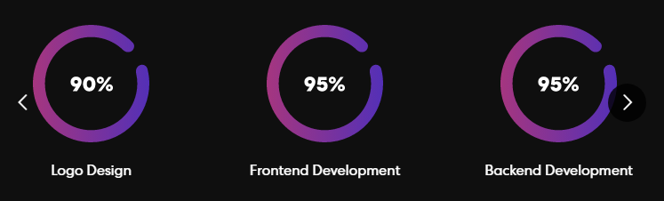
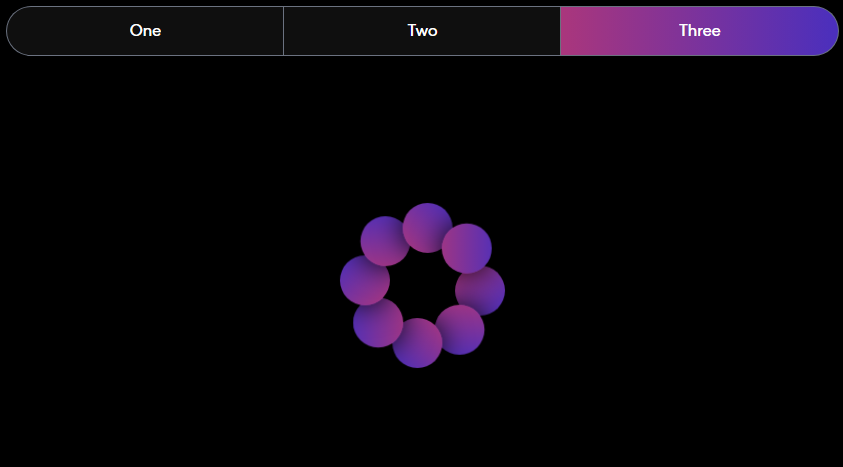

# Space Portfolio
Simple Home Page

## Features
- [x] Beautiful & Modern Design
- [x] Responsive Design
- [x] Scrollbar Customized
- [x] Animations
- [x] Carousel
- [x] Tabs

## Dependencies
- Vite
- React
- React Icons
- TailWindCSS
- TailWind Scrollbar
- React Multi Carousel
- RadixUI React Tabs
- Animate.css

## References
- [Portfolio Tutorial](https://www.youtube.com/watch?v=hYv6BM2fWd8)
- [Responsive Navbar](https://www.youtube.com/watch?v=X6CsbhSVUEc)
- [Performant Animations](https://www.youtube.com/watch?v=4PStxeSIL9I)
- [CSS Animations Tutorial](https://www.youtube.com/watch?v=YszONjKpgg4)
- [Water CSS Animation](https://www.youtube.com/watch?v=v5uHEUnEjwM)
- [Spinner Animation](https://www.youtube.com/watch?v=8ipFyy7HpqQ)

## About

<div align="center">


<br/>
<br/>

🚀 Watch a demo [here!](https://da8ah.github.io/react-space-portfolio/)
</div>
<br/>

This project is a space-themed web page that showcases the work you've done and the experience you've achieved. It is built with:
- [Vite](https://vitejs.dev/guide/)
- [React](https://react.dev/)
- [React Icons](https://react-icons.github.io/react-icons/)
- [Tailwind](https://tailwindcss.com/docs/guides/vite)
- [Tailwind Scrollbar](https://www.npmjs.com/package/tailwind-scrollbar)
- [React Multi Carousel](https://www.npmjs.com/package/react-multi-carousel/v/1.2.9)
- [RadixUI React Tabs](https://www.radix-ui.com/docs/primitives/components/tabs)
- [Animate.css](https://animate.style/). 

It is responsive and adapts to different screen sizes and devices. You can also see different animations and effects. This project is a interactive way to present who you are through your portfolio.

## Local Setup

- PNPM
```bash
$ npm i --location=global pnpm
```
- Install dependencies and Run
```bash
$ git clone https://github.com/da8ah/react-krypto-home.git
$ pnpm install
$ pnpm run dev
```

## Results

### Responsive Design (React)

Background images don't show in some sections. You can see a full working version in the [Demo](https://da8ah.github.io/react-space-portfolio/).

|Mobile|Tablet|Desktop|
|:------------:|:------------:|:------------:|
||||
<br/>

### Animations

Mobile Navbar

<div align="center" style="width:100%;display:flex;flex-direction:row;justify-content:space-evenly;align-items:flex-start;">


</div>
<br/>

Navbar Hover

<div align="center" style="width:100%;display:flex;flex-direction:column;justify-content:space-evenly;align-items:center;">

<br/>
<br/>

</div>
<br/>

Carousel

<div align="center" style="width:100%;display:flex;flex-direction:column;justify-content:space-evenly;align-items:center;">

<br/>
<br/>

</div>
<br/>

Tabs

<div align="center" style="width:100%;display:flex;flex-direction:column;justify-content:space-evenly;align-items:center;">

<br/>
<br/>

<br/>
<br/>

</div>
<br/>
<br/>

## Changelog

(Tiber) **Abril 2023 v1.0.0**
* Navbar
* Banner
* Skills
* Projects
* Contact
* Footer